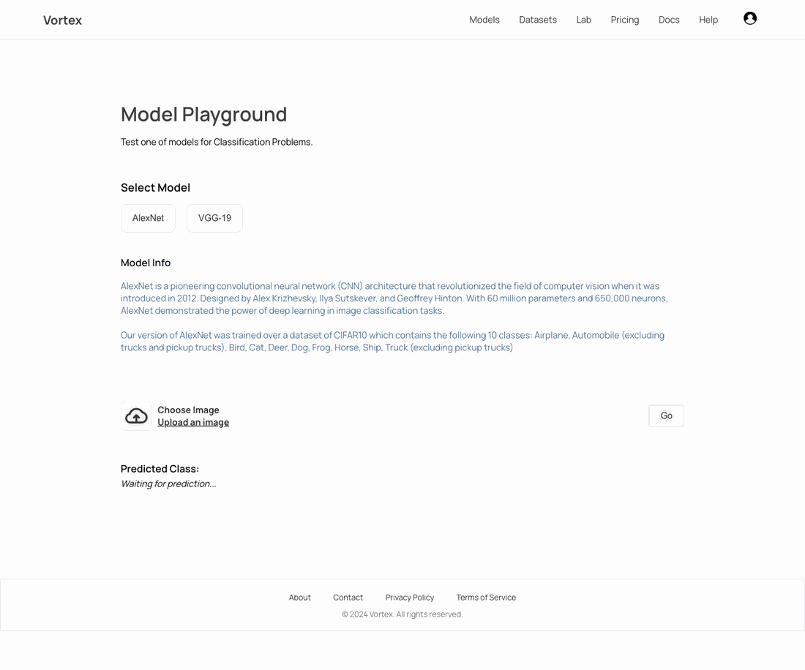
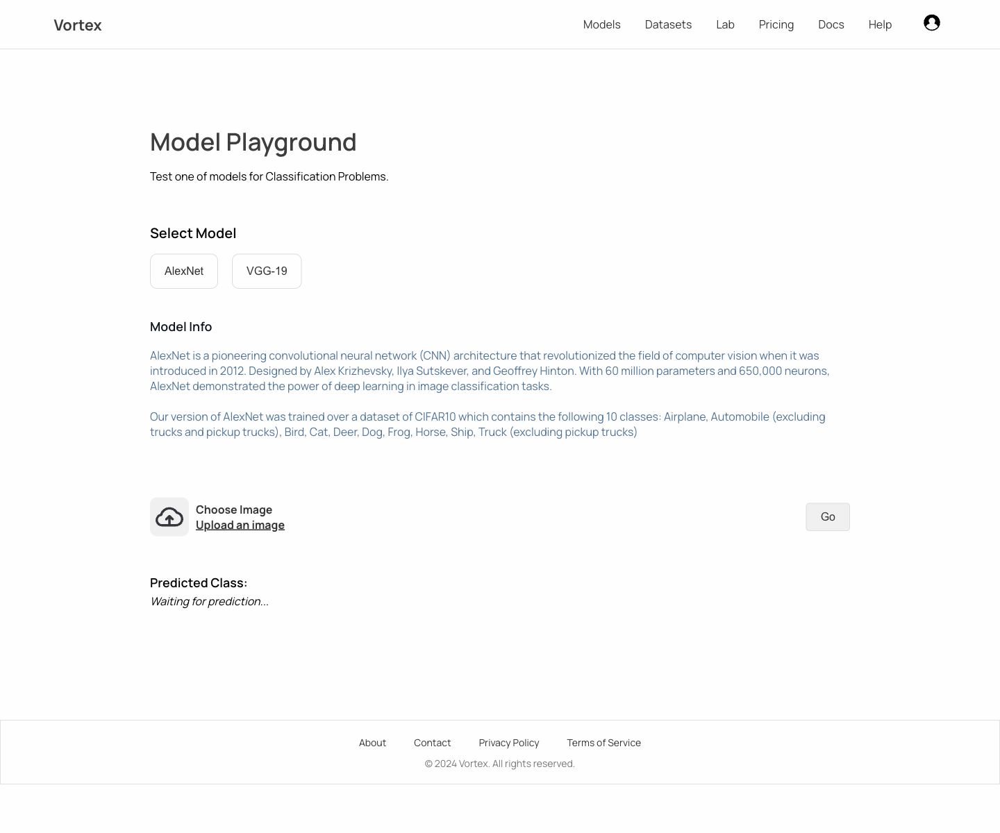
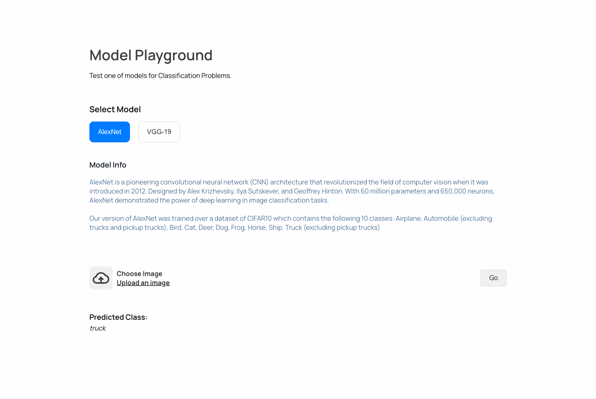
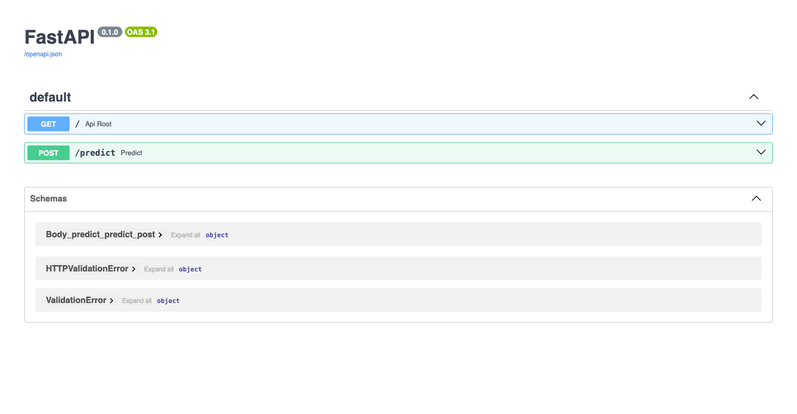

# VortexML

VortexML is a full-stack image classification demo built with a React frontend, a FastAPI backend, and a custom AlexNet checkpoint trained on CIFAR-10. The project is set up to let you run the UI locally, upload an image, and inspect the prediction flow end to end.

## Live Links

- Frontend demo: [https://sakshambedi.github.io/VortexML](https://sakshambedi.github.io/VortexML)
- Local frontend: `http://localhost:3000/VortexML`
- Local API docs: `http://localhost:8000/docs`

## Table of Contents

- [Overview](#overview)
- [Visual Tour](#visual-tour)
- [Features](#features)
- [Tech Stack](#tech-stack)
- [Repository Layout](#repository-layout)
- [Local Development](#local-development)
- [API Reference](#api-reference)
- [Model Notes](#model-notes)
- [Docker](#docker)
- [Contributing](#contributing)

## Overview

The current project ships one end-to-end inference path: AlexNet on CIFAR-10. The frontend exposes a model playground, image upload, and prediction panel, while the backend handles preprocessing, inference, and the `/predict` API.

If you are running the app locally, the expected flow is:

1. Start the FastAPI backend on port `8000`.
2. Start the React frontend on port `3000`.
3. Open `http://localhost:3000/VortexML`.
4. Choose a model, upload an image, and press `Go`.

## Visual Tour

### End-to-End Inference Flow

The GIF below shows the full local interaction: open the playground, select `AlexNet`, choose an image, submit it, and view the predicted class.



### Application Overview



### Prediction Result



### FastAPI Swagger Docs



## Features

- Upload an image and send it to the backend for classification.
- Run local inference against a trained AlexNet checkpoint.
- Inspect the backend with FastAPI's built-in Swagger UI.
- Deploy the frontend to GitHub Pages and the backend with Docker.

Current implementation note:
AlexNet is the only model wired through the backend today. The `VGG-19` button is present in the UI, but it does not connect to a separate inference path yet.

## Tech Stack

### Frontend

- React 18
- CSS modules and component-scoped styles
- Create React App build pipeline

### Backend

- FastAPI
- PyTorch
- Torchvision transforms
- Pillow

### Deployment

- GitHub Pages for the frontend
- Docker for the backend

## Repository Layout

```text
.
|-- back-end/
|   |-- server.py
|   |-- requirements.txt
|   `-- AlexNet_Param.pth
|-- docs/
|   `-- assets/
|-- output/
|   `-- playwright/
`-- vortex-ml-frontend/
    |-- src/
    |-- public/
    `-- package.json
```

## Local Development

### Prerequisites

- Python 3.12+
- Node.js 16+
- npm

### 1. Start the backend

```bash
cd back-end
python -m venv venv
source venv/bin/activate
pip install -r requirements.txt
uvicorn server:app --host 127.0.0.1 --port 8000 --reload
```

The model checkpoint must be available at `back-end/AlexNet_Param.pth`.

### 2. Start the frontend

```bash
cd vortex-ml-frontend
npm install
npm start
```

The frontend uses the API endpoint from `.env`:

```bash
REACT_APP_VORTEXML_API_ENDPOINT=http://localhost:8000/predict
```

### 3. Open the app

Visit `http://localhost:3000/VortexML` and run a prediction from the playground.

## API Reference

### `POST /predict`

Uploads an image and returns the predicted CIFAR-10 class id.

Request:

```bash
curl -X POST "http://localhost:8000/predict" \
  -H "accept: application/json" \
  -H "Content-Type: multipart/form-data" \
  -F "file=@your_image.jpg"
```

Response:

```json
{
  "class_id": 9
}
```

### `GET /`

Basic root endpoint used during local verification.

### Class Mapping

- `0`: airplane
- `1`: automobile
- `2`: bird
- `3`: cat
- `4`: deer
- `5`: dog
- `6`: frog
- `7`: horse
- `8`: ship
- `9`: truck

Interactive API docs are available at `http://localhost:8000/docs`.

## Model Notes

- Architecture: AlexNet
- Parameters: about 60 million
- Input pipeline: resize to `70x70`, center crop to `64x64`, normalize with CIFAR-10 statistics
- Dataset: CIFAR-10
- Classes: airplane, automobile, bird, cat, deer, dog, frog, horse, ship, truck

## Docker

Build the backend image:

```bash
cd back-end
docker build -t vortexml-backend .
```

Run the container:

```bash
docker run --name vortexml-api -p 8000:8000 vortexml-backend
```

After startup, open `http://localhost:8000/docs`.

## Contributing

1. Fork the repository.
2. Create a feature branch.
3. Make your changes.
4. Open a pull request.

## License

No license file is currently checked into the repository.
